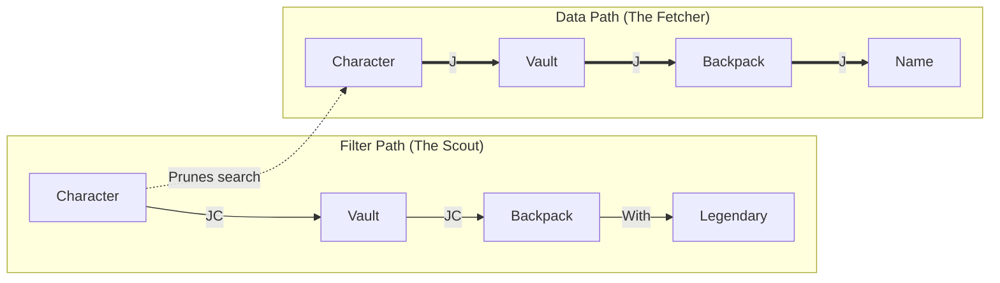

# bevy_spliff 💨

[](https://github.com/NicoZweifel/bevy_spliff?tab=readme-ov-file#licensecreditsinspirationsreferences)
[](https://crates.io/crates/bevy_spliff)
[](https://crates.io/crates/bevy_spliff)
[](https://docs.rs/bevy_spliff/)
[](https://github.com/NicoZweifel/bevy_spliff/actions/workflows/ci.yaml)

A crate for doing joins in bevy.

> [!CAUTION]
> This is an experiment.

## Setup

Just add the dependency.

```bash
cargo add bevy_spliff
```

And the `Joinable` derive macro to your relations, e.g.:

```rust
#[derive(Component, Joinable, Default)]
#[relationship_target(relationship = InventoryItemOf)]
struct InventoryItems(Vec<Entity>);

#[derive(Component, Joinable)]
#[relationship(relationship_target = InventoryItems)]
struct InventoryItemOf(pub Entity);

#[derive(Component, Joinable, Default)]
#[relationship_target(relationship = WeaponOf)]
struct Weapons(Vec<Entity>);

#[derive(Component, Joinable)]
#[relationship(relationship_target = Weapons)]
struct WeaponOf(pub Entity);

#[derive(Component, Joinable, Default)]
#[relationship_target(relationship = StorageItemOf)]
struct StorageItems(Vec<Entity>);

#[derive(Component, Joinable)]
#[relationship(relationship_target = StorageItems)]
struct StorageItemOf(pub Entity);
```

## Usage

Imagine you are writing a system that needs to fetch nested data,
currently this would look sth like this:

```rust
fn manual_system(
    q_characters: Query<(&Name, &InventoryItems), With<Character>>,
    q_items: Query<&Name>,
) {
    for (name, inventory) in &q_characters {
        let item_names: Vec<&Name> = inventory.0.iter()
            .filter_map(|&e| q_items.get(e).ok())
            .collect();

        println!("Character {:?} has items: {:?}", name, item_names);
    }
}
```

### Simple Join

This simplifies to:

```rust
fn join_system(q: Query<(&Name, J<InventoryItems, &Name>), With<Character>>) {
    for (name, item_names) in &q {
        println!("{name:?} has items: {item_names:?}");
    }
}
```

> [!NOTE]
> By default, `Join<R, D>` (or `J<R, D>`) fetches all related entities. If none exist,
> it returns an empty `Vec` or `None` but does not skip the root entity.

### Join First

`JoinFirst<R, D>` (or `JF<R, D>`) fetches the first valid target. If no target satisfies the data requirements, the root entity is skipped.

```rust
fn join_first_system(q: Query<(&Name, JF<InventoryItems, (&Name, &Legendary)>), With<Character>>) {
    for (name, (item_name, _)) in &q {
        println!("{name:?} has a legendary: {item_name:?}");
    }
}
```

### Understanding the Filter Hierarchy

You can control filtering at two levels. The following examples show how to progress from loose (root) to strict (nested) filtering.

#### The "Loose" Filter

Use `JoinCondition<R, F>` (or `JC<R, F>`) in your Query Filter.
This ensures the root entity is only processed if at least one related entity satisfies the join condition.

```rust
fn loose_filter(
    q: Query<(&Name, J<InventoryItems, &Name>), (With<Character>, JC<InventoryItems, With<Legendary>>)>
) {
    // Only legendary owners enter here, but we see their Rags and Potions too.
}
```

#### The "Strict" Filter

To filter the join results (the `Vec` or `Option`) so it only contains items matching your criteria, include the filter in the `Query Data`.

```rust
fn strict_filter(
    q: Query<(&Name, J<InventoryItems, (&Name, &Legendary)>), With<Character>>
) {
    // Every character enters here, but the Vec ONLY contains legendary items.
}
```

#### Combined (The "True" Inner Join)

```rust
fn combined_filter(
    q: Query<
        (&Name, J<InventoryItems, (&Name, &Legendary)>),
        JC<InventoryItems, With<Legendary>>
    >
) {
    // Only legendary item owners enter, and they only see their legendary items.
}
```

> [!IMPORTANT]
> If you use a `JC` filter but don't mirror that requirement in your `J` or `JF` data, you will get "unfiltered" results.
>
> For `J`: You will get a `Vec` containing all items, even if only one triggered the `JC`.
>
> For `JF`: You will get the first item in the list, even if a later item was the one that satisfied the `JC`.
>
> To ensure your fetched data matches your filter, always include the relevant component/filter in the `Join` or `JoinFirst` type.

#### Visualizing the logic

```mermaid
graph TD
    subgraph World
        C[Character: Player]
        Junction(( ))
        I1[Item: Rusty Sword]
        I2[Item: Fancy Sword]
        I2 -.-> L[Component: Legendary]

        C ---|InventoryItems| Junction
        Junction --> I1
        Junction --> I2
    end

    subgraph "Query Logic"
        direction TB
        Filter{"JC<Inventory, With<Legendary>>"}
        DataFetch[["J<Inventory, &Name>"]]
    end

    C --> Filter
    Filter -- "Pass: JC Root Match" --> DataFetch

    I1 -- "Data Filter: Skip" --> DataFetch
    I2 -- "Data Filter: Collect" --> DataFetch

    DataFetch --> Result["Result: (Player, ['Fancy Sword'])"]

    style Junction fill:#333,stroke:#333,width:5px,height:5px
    style Filter fill:#fff,stroke:#333,stroke-width:2px
    style I2 fill:#f9f,stroke:#333
    style L fill:#f9f,stroke:#333
```



### Deep Nesting

In complex hierarchies, the `JC` acts as a "pathfinder" for the `J` fetcher.



> [!TIP]
> In deeply nested trees, using JC in your QueryFilter acts as a Scout that prunes the search.
> It stops the engine from even attempting to fetch or allocate data for a branch that doesn't lead to a match.

You can nest these types indefinitely to traverse complex hierarchies,
such as a Character $\rightarrow$ Vault $\rightarrow$ Backpack $\rightarrow$ Items hierarchy, e.g.,

Get all items in all inventories of all vaults for all armed characters:

```rust
fn deeply_nested_system(
    q: Query<
        (&Name, J<StorageItems, (&Name, J<InventoryItems, &Name>)>),
        (With<Character>, JC<StorageItems, JC<InventoryItems, With<Weapon>>>),
    >,
) {
for (character_name, storages) in &q {
    for (storage_name, inventories) in storages {
        for inventory_item_name in inventories {
            println!(
                "Character {} has a {} containing an item: {}",
                character_name, storage_name, inventory_item_name
            );
        }
    }
}
```

### Readability

For complex systems with deeply nested fully filtered queries, you can use `J`, `JF`, and `JC` inside structs that derive QueryData or QueryFilter.
This might resolve warnings/readability issues and allows you to provide descriptive names for your joined data:

```rust
#[derive(QueryData)]
pub struct DeepCharacterData {
    pub name: &'static Name,
    pub storages: J<StorageItems, StorageLevel>,
}

#[derive(QueryData)]
pub struct StorageLevel {
    pub name: &'static Name,
    pub inventories: J<InventoryItems, (&'static Name, &'static Legendary)>,
}

#[derive(QueryFilter)]
pub struct CharacterFilter {
  _is_character: With<Character>,
  _has_legendary: JC<StorageItems, JC<InventoryItems, With<Legendary>>>,
}

fn cleaned_up_system(q: Query<DeepCharacterData, CharacterFilter>) {
    for character in &q {
        for storage in character.storages {
            // storage.name, storage.inventories...
        }
    }
}
```

## Overview

| Feature              | Type Alias        | Description                                                                                                                                                             | Example Usage                  |
| -------------------- | ----------------- | ----------------------------------------------------------------------------------------------------------------------------------------------------------------------- | ------------------------------ |
| **Join**           | `J<Ref, Data>`    | Fetches a `Vec` or `Option` containing targets matching Data. If combined with `JC`, it eagerly fetches the full list as long as at least one target passes the filter. | `J<Weapons, &Name>`            |
| **Join First**     | `JF<Ref, Data>`   | Traverses a relationship and returns only the first target that matches the query data.                                                                                 | `JF<Weapons, &Name>`           |
| **Join Condition**   | `JC<Ref, Filter>` | A query filter that checks if any target of a relationship satisfies a specific condition.                                                                              | `JC<Weapons, With<Legendary>>` |
| **Derive Macro**     | `Joinable`        | Automatically implements the `Joinable` trait for structs containing an `Entity` or `Vec<Entity>`.                                                                      | `#[derive(Joinable)]`          |
| **Deep Nesting**     | N/A               | Supports recursive joins (joining on a join result) for complex hierarchy traversals.                                                                                 | `J<A, (Data, J<B, Data>)>`     |
| **Built-in Support** | N/A               | Native support for standard Bevy hierarchy components like `Children` and `ChildOf`.                                                                                    | `J<Children, &Name>`           |
| **Change Detection** | N/A               | Integrates with Bevy's change detection within the join filters.                                                                                                        | `JC<R, Changed<T>>`            |

### Key Definitions

- `Ref`: A relational component implementing `Joinable` (e.g., a field containing a target `Entity`).
- `Data`: The `QueryData` you wish to retrieve from the target entity.
- `Filter`: A `QueryFilter` to validate the target entity without fetching data.

## SQL Analogs

If you are coming from a relational database background, here is how `bevy_spliff` types conceptually map to standard SQL operations.

Because Bevy queries do not duplicate the "Root" entity for multiple matches (unlike standard SQL joins, which return multiple rows), `bevy_spliff` instead aggregates the targets into a `Vec`.

| `bevy_spliff`                             | SQL Concept                  | Behavior                                                                                  | Empty/Broken List Behavior                     |
| :---------------------------------------- | :--------------------------- | :---------------------------------------------------------------------------------------- | :--------------------------------------------- |
| `J<Ref, Data>`                            | `LEFT JOIN`                  | Fetches an array of targets that possess the requested `Data`.                            | Keeps the root entity, returns an empty `Vec`. |
| `J<Ref, Option<Data>>`                    | `LEFT JOIN`                  | Fetches an array of all targets, wrapping missing data in `None`.                         | Keeps the root entity, returns an empty `Vec`. |
| `JF<Ref, Data>`                           | `INNER JOIN` (First Match)   | Fetches only the first target that possesses the requested `Data`.                        | Filters out the root entity from the query.    |
| `JC<Ref, Filter>`                         | `WHERE EXISTS`               | Evaluates a condition against targets without fetching their data.                        | Filters out the root entity from the query.    |
| `J<Ref, Data>` + `JC<Ref, Filter>`        | `LEFT JOIN` + `WHERE EXISTS` | Fetches **all** matches as a `Vec`, requires $\ge 1$ match but only applies `JC` to root. | Filters out the root entity from the query.    |
| `J<Ref, (Data, &C)>` + `JC<Ref, With<C>>` | `INNER JOIN` (1-to-Many)     | Fetches a `Vec` of strictly matching targets, and requires $\ge 1$ match.                 | Filters out the root entity from the query.    |

> [!TIP]
> **Understanding 1-to-Many Joins:**
> By default, combining `J` with `JC` acts as an existence check: if _any_ target passes `JC`,
> the `J` fetcher eagerly fetches **all** targets matching its `QueryData`.
>
> To create a strict 1-to-Many Inner Join (where the resulting Vec only contains specific targets,
> AND the root entity is skipped if there are zero matches),
> require the component in your Data tuple and include `JC` in your query filter:
> `Query<(&Name, J<Weapons, (&Name, &Legendary)>), JC<Weapons, With<Legendary>>>`
>
> You can also use `Has` to filter in the system body, if desired.

## Okay... so when to use what then?

Choosing between `J`, `JF`, and `JC` comes down to **Optionality** (do they _need_ to have it?) and **Multiplicity** (do you need _all_ of them, or just _one_?).

- **I need to process all related items.**
  -> Use **`J`** (Returns a `Vec`).
  _Example: Calculating the total weight of a player's inventory._
- **I need one related item, but it's okay if they don't have any.**
  -> Use **`J`** (Returns an empty `Vec` or `Option` depending on the mapper).
  _Example: Drawing a weapon icon on the UI. Unarmed players should still have their UI drawn, just with an empty weapon slot._
- **I need one related item, and the system should SKIP entities that don't have it.**
  -> Use **`JF`** (Returns the item directly, acts as an Inner Join).
  _Example: A combat system. Players without an equipped weapon cannot attack and should be skipped by the system._
- **I don't need the data, I just care IF they have it.** Use **`JC`** (Acts as a Query Filter).
  _Example: A healing system or for usage with marker components, e.g. you only want to query players that have a Health Potion in their inventory, but you don't need to read the data yet._

## Feature Flags

These are enabled by default.

- `type-aliases`: Enables shorthand names like J, JF, and JC.
- `derive`: Enables the `#[derive(Joinable)]` macro.

## Notes / TODOs

- **Mutable access on `Join`:** Currently, `Join` only supports `ReadOnlyQueryData`. True mutable joins require careful handling to prevent mutable aliasing (i.e., multiple root entities yielding `&mut` access to the same target entity).
- **Cleanup `WorldQuery`/`QueryData` Boilerplate:** Refactor the internal implementations for `J`, `JF`, and `JC` using generic `JoinQuery` implementations or macros to reduce duplicated code.
- Depends on `bevy_ecs` only (and `syn` etc. if you use the macro).
- More test cases and organizing suites.
- Make sure this doesn't do something terribly wrong (should be fine though at this point).
- Bevy's iteration order is nondeterministic. If you need stable sorting, use `Join` (`J`) to get a `Vec` and sort it in the system body.
- Docs.
- More/better tests.

## License

The code is dual-licensed:

- MIT License ([LICENSE-MIT](LICENSE-MIT) or [http://opensource.org/licenses/MIT](http://opensource.org/licenses/MIT))
- Apache License, Version 2.0 ([LICENSE-APACHE](LICENSE-APACHE) or [http://www.apache.org/licenses/LICENSE-2.0](http://www.apache.org/licenses/LICENSE-2.0))
